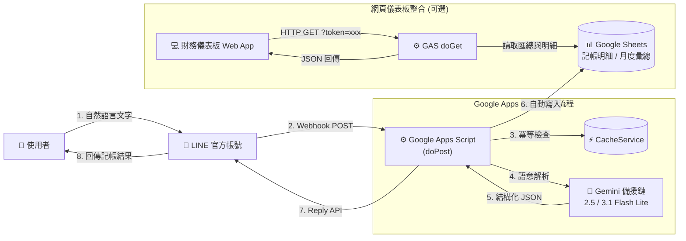

# 🤖 LINE-Bot-AI-Google-Apps-Script-Gemini

> **全自動 Serverless AI 記帳機器人**  
> 使用自然語言在 LINE 聊天即可智慧記帳。由 Google Gemini AI 自動擷取「項目、金額、類別」，防重複記帳，即時寫入 Google Sheets，並提供安全 API 供前端網頁儀表板連動！

[](https://developers.google.com/apps-script)
[](https://ai.google.dev/)
[](https://developers.line.biz/)
[](https://www.google.com/sheets/about/)
[](LICENSE)

---

## 📑 目錄

- [✨ 核心特色](#-核心特色)
- [🏛️ 系統架構](#️-系統架構)
- [🛠️ 技術棧](#️-技術棧)
- [📋 準備工作與完整申請流程](#-準備工作與完整申請流程)
  - [1. LINE 官方帳號與 Messaging API 設定](#1-line-官方帳號與-messaging-api-設定)
  - [2. 取得 Google Gemini API Key](#2-取得-google-gemini-api-key)
  - [3. 設定 Google Sheets 試算表與報表公式](#3-設定-google-sheets-試算表與報表公式)
- [🚀 部署 Google Apps Script (GAS)](#-部署-google-apps-script-gas)
  - [步驟一：貼上程式碼](#步驟一貼上程式碼)
  - [步驟二：設定「指令碼屬性」（重要安全性）](#步驟二設定指令碼屬性重要安全性)
  - [步驟三：發布為網頁應用程式 (Web App)](#步驟三發布為網頁應用程式-web-app)
  - [步驟四：串接 LINE Webhook](#步驟四串接-line-webhook)
- [💬 使用方式與範例](#-使用方式與範例)
- [🌐 網頁儀表板專用 API (doGet)](#-網頁儀表板專用-api-doget)
- [⚠️ 常見問題與注意事項](#️-常見問題與注意事項)
- [📄 授權條款](#-授權條款)

---

## ✨ 核心特色

- 💬 **純自然語言記帳**：免點按鈕、免打死板格式。在 LINE 傳送「午餐排骨便當 120」或「全聯買洗碗精衛生紙 380」，AI 即刻自動解析。
- 🧠 **Gemini AI 五大分類體系**：自動判斷並標準化歸納為 5 大核心消費類別：
  - `生存`：三餐飲食、通勤交通、就醫、藥費等基本生理需求。
  - `家用`：房租、水電瓦斯、日用品、超市食材等維持家庭運作開銷。
  - `社交`：聚餐、送禮、請客、紅白包等人際往來支出。
  - `娛樂`：串流影音 (Netflix/Spotify)、電玩、旅遊、模型公仔等精神娛樂。
  - `雜支`：無法歸入以上四類的其他彈性支出。
- 🛡️ **多模型自動容錯備援鏈 (Fallback Chain)**：
  - 依序嘗試 `gemini-2.5-flash-lite`（低延遲主力）➜ `gemini-3.1-flash-lite-preview` ➜ `gemini-3.1-flash-lite`。
  - 面對 503 伺服器過載或 429 速率限制時，自動執行階梯式延遲重試（5 秒、10 秒），大幅提升連線穩定度。
- 🔒 **防重複寫入機制 (Idempotency)**：使用 GAS `CacheService` 捕捉 LINE 的 `webhookEventId`（上鎖 10 分鐘），完美防禦網路抖動造成 LINE Webhook 重試所引發的重複記帳。
- 🔐 **零明碼金鑰管理**：全面採用 Google Apps Script **指令碼屬性 (Script Properties)**，程式碼不包含任何私人 Key，公開開源安心無虞。
- 📊 **雙向整合 (LINE Bot + Web 儀表板)**：
  - `doPost(e)`：專職接收 LINE Webhook 並呼叫 AI 寫入資料。
  - `doGet(e)`：內建通關密鑰 Token 驗證，提供安全 JSON 介面，供前端網頁儀表板（如 React / Tailwind CSS / Recharts）讀取即時數據。

---

## 🏛️ 系統架構



---

## 🛠️ 技術棧

- **Runtime 環境**：Google Apps Script (GAS) — *完全免費、無需伺服器維護*
- **訊息通訊平台**：LINE Messaging API (LINE Developers)
- **AI 語言模型**：Google Gemini API (`gemini-2.5-flash-lite` 及備援鏈)
- **資料庫與報表**：Google Sheets + 原生 `QUERY` 動態函式

---

## 📋 準備工作與完整申請流程

### 1. LINE 官方帳號與 Messaging API 設定

跟隨以下步驟申請免費的 LINE Bot：

#### 步驟 1-1：建立 LINE 官方帳號 (LINE Official Account)
1. 前往 [LINE Official Account Manager](https://manager.line.biz/)。
2. 點選 **「使用 LINE 個人帳號登入」**。
3. 點擊右上角或選單中的 **「建立官方帳號」**。
4. 填寫帳號基本資訊：
   - **帳號名稱**：例如 `AI 記帳小秘書`
   - **電子郵件**：輸入你的常用 Email
   - **業種**：選擇「個人」或其他合適類別
5. 點擊「確認」➜「完成」，即可進入官方帳號後台管理介面。

#### 步驟 1-2：啟用 Messaging API
1. 在官方帳號後台右上角點選 **「設定」⚙️**。
2. 在左側選單中找到並點擊 **「Messaging API」**。
3. 點擊頁面中的綠色按鈕 **「啟用 Messaging API」**。
4. 輸入或選擇 **Provider（服務提供者）名稱**（例如：`MyExpenseProject`）。
5. 填寫隱私權政策與服務條款網址（個人私用可直接略過留空），點擊「確定」。

#### 步驟 1-3：在 LINE Developers Console 發行 Channel Access Token
1. 啟用完成後，點擊頁面上的 **「LINE Developers」** 連結，或直接前往 [LINE Developers Console](https://developers.line.biz/console/)。
2. 在主畫面點擊進入剛才建立的 Messaging API Channel。
3. 切換至 **「Messaging API」** 標籤頁。
4. 捲動至最下方的 **Channel access token** 區塊。
5. 點擊 **「Issue」** 按鈕發行長期 Token。
6. 複製整段 **Channel access token**（請先妥善保存在記事本中，後面步驟會使用）。

#### 步驟 1-4：關鍵設定調整（避免機器人自動回覆干擾）
在 LINE 官方帳號管理後台：
1. 進入左側選單的 **「回應設定」**。
2. **回應模式**：選擇 **「Bot（聊天機器人）」**。
3. **自動回應訊息**：切換為 **「關閉」**（避免輸入文字時官方預設回覆跑出來打架）。
4. **加入好友歡迎訊息**：可視個人喜好保留或關閉。
5. **Webhook**：切換為 **「開啟」**。

#### 步驟 1-5：掃描 QR Code 加入機器人為好友
- 在 LINE Developers 的「Messaging API」分頁最上方，或官方帳號後台，可以看到一組專屬的 **QR code**。
- 請拿起手機開啟 LINE 掃描 QR code，將這台專屬記帳機器人加入好友！

---

### 2. 取得 Google Gemini API Key

1. 前往 [Google AI Studio](https://aistudio.google.com/)。
2. 使用你的 Google 帳號登入。
3. 點擊左上方 **「Get API key」**。
4. 點擊 **「Create API key」**（可選擇已有的 Google Cloud 專案或自動新建）。
5. 複製生成的 API Key，妥善保存備用。

---

### 3. 設定 Google Sheets 試算表與報表公式

1. 在 Google 雲端硬碟建立一個新的 Google 試算表（例如命名為：`個人記帳本`）。
2. 從試算表網址中複製 **試算表 ID (SPREADSHEET_ID)**：
   ```text
   https://docs.google.com/spreadsheets/d/【這一段長字串就是 SPREADSHEET_ID】/edit
   ```
3. 在該試算表中建立 **三個工作表（分頁）**，分頁名稱必須完全相符：
   - `記帳明細`
   - `月度彙總`
   - `分類統計`

#### 📊 貼上報表公式

- **在 `月度彙總` 分頁的 `A1` 儲存格** 貼上以下公式：
  ```excel
  =QUERY('記帳明細'!A:E, "SELECT E, SUM(D) WHERE A IS NOT NULL GROUP BY E ORDER BY E DESC LABEL E '月份', SUM(D) '總支出'", 1)
  ```

- **在 `分類統計` 分頁的 `A1` 儲存格** 貼上以下公式：
  ```excel
  =QUERY('記帳明細'!A:E, "SELECT E, C, SUM(D) WHERE A IS NOT NULL GROUP BY E, C ORDER BY E DESC LABEL E '月份', C '類別', SUM(D) '總金額'", 1)
  ```

*(備註：`記帳明細` 的資料將由機器人自動寫入，欄位順序為：時間、項目、類別、金額、月份。)*

---

## 🚀 部署 Google Apps Script (GAS)

### 步驟一：貼上程式碼
1. 在剛剛建立的 Google 試算表中，點擊上方選單 **「擴充功能」 ➜ 「Apps Script」**。
2. 清空編輯器內既有的範例代碼，將本專案的 [`Code.gs`](./Code.gs) 內容完整貼入。
3. 點擊上方磁碟片圖示 💾（或按 `Ctrl + S`）儲存。

### 步驟二：設定「指令碼屬性」（重要安全性）
> 💡 **告別明碼洩漏風險！** 我們透過環境變數保存所有密鑰，不需要修改程式碼本體。

1. 在 Apps Script 左側邊欄點選 **「專案設定」⚙️**（齒輪圖示）。
2. 捲動至下方找到 **「指令碼屬性」**，點選 **「新增指令碼屬性」**。
3. 依序新增以下 4 個屬性名稱與對應的值：

| 屬性 (Property) | 值 (Value) | 說明 |
| :--- | :--- | :--- |
| `LINE_CHANNEL_ACCESS_TOKEN` | *貼上步驟 1-3 取得的 LINE 長期 Token* | LINE Bot 發訊權杖 |
| `GEMINI_API_KEY` | *貼上步驟 2 取得的 Gemini API Key* | Gemini AI 呼叫金鑰 |
| `SPREADSHEET_ID` | *貼上步驟 3 取得的 Google Sheet ID* | 記帳試算表 ID |
| `API_SECRET_TOKEN` | *自訂一串英數密碼（例如 `my_secret_token_888`）* | 供網頁儀表板讀取資料驗證 |

4. 點選 **「儲存指令碼屬性」**。

### 步驟三：發布為網頁應用程式 (Web App)
1. 點擊 Apps Script 右上角的 **「部署」 ➜ 「新增部署」**。
2. 點選左側齒輪 ⚙️「選取類型」，選擇 **「網頁應用程式 (Web App)」**。
3. 設定部署參數：
   - **說明**：`v3-production`
   - **執行身分**：`我 (Me)`
   - **誰可以存取**：`任何人 (Anyone)` *(注意：此設定才能接收 LINE 官方發出的 Webhook)*
4. 點選 **「部署」**。
5. 初次部署時會跳出 **「授予存取權」** 視窗：
   - 選擇你的 Google 帳號。
   - 點選「進階 (Advanced)」➜「前往『未命名專案』(不安全)」。
   - 點擊「允許 (Allow)」以授權 Apps Script 讀寫試算表及連線外部 API。
6. 複製生成的 **網頁應用程式網址 (Web App URL)**（格式如：`https://script.google.com/macros/s/xxxx/exec`）。

### 步驟四：串接 LINE Webhook
1. 回到 [LINE Developers Console](https://developers.line.biz/console/) ➜ 你的 Messaging API Channel。
2. 切換至 **「Messaging API」** 標籤頁。
3. 找到 **Webhook URL** 欄位：
   - 點選 **「Edit」**，貼上剛複製的 **GAS Web App URL**。
   - 點擊 **「Update」** 儲存。
4. 將 **「Use webhook」** 開關切換為 **開啟 (On)**。
5. 點擊 **「Verify」** 按鈕驗證：
   - 若彈出 `Success` (HTTP 200)，恭喜你！串接大功告成 🎉！
6. *(建議)* 在 Webhook URL 下方將 **「Webhook redelivery」** 設為 **關閉 (Off)**。

---

## 💬 使用方式與範例

在手機上打開 LINE，向你的官方帳號發送日常口語文字：

| 你的輸入範例 | AI 解析結果 | 分類 |
| :--- | :--- | :--- |
| `午餐排骨飯 120` | 項目：午餐排骨飯、金額：120 | **生存** |
| `捷運定期票 1280` | 項目：捷運定期票、金額：1280 | **生存** |
| `全聯採買食材和衛生紙 560` | 項目：全聯採買食材和衛生紙、金額：560 | **家用** |
| `繳台電電費 1450` | 項目：繳台電電費、金額：1450 | **家用** |
| `請朋友吃海底撈 1800` | 項目：請朋友吃海底撈、金額：1800 | **社交** |
| `週末看阿凡達電影票 340` | 項目：週末看阿凡達電影票、金額：340 | **娛樂** |
| `Netflix 續訂扣款 390` | 項目：Netflix 續訂扣款、金額：390 | **娛樂** |
| `買五金工具螺絲起子 150` | 項目：買五金工具螺絲起子、金額：150 | **雜支** |

機器人回覆訊息範例：
```text
✅ 記帳成功
項目：午餐排骨飯
金額：120
分類：生存
```
同時該筆紀錄會自動追加進 Google 試算表的 `記帳明細` 中，`月度彙總` 及 `分類統計` 分頁亦會由公式即時重新計算！

---

## 🌐 網頁儀表板專用 API (doGet)

本程式碼內建了專屬的 `doGet(e)` 接口，能將試算表中的數據轉換為乾淨的 JSON 回傳，方便串接 React / Vue 財務視覺化儀表板。

### 請求格式
```http
GET https://script.google.com/macros/s/YOUR_DEPLOY_ID/exec?token=YOUR_API_SECRET_TOKEN
```

### 驗證機制
- 必須在網址 Query String 帶入 `?token=YOUR_API_SECRET_TOKEN`。
- 若 Token 不符或未帶入，API 會自動回應 `403 Forbidden`，確保個人私密帳務安全無虞。

### 回傳範例 (JSON)
```json
{
  "status": "success",
  "updatedAt": "2026-09-05T00:00:00.000Z",
  "details": [
    ["時間", "項目", "類別", "金額", "月份"],
    ["2026-08-29T04:30:00.000Z", "午餐排骨飯", "生存", 120, "2026-08"]
  ],
  "summary": [
    ["月份", "總支出"],
    ["2026-08", 12850],
    ["2026-07", 19400]
  ]
}
```

---

## ⚠️ 常見問題與注意事項

1. **更新程式碼後沒生效？**
   - 在 Google Apps Script 修改程式碼或屬性後，必須點選 **「部署」 ➜ 「管理部署」 ➜ 編輯 ➜ 版本選「新版本」 ➜ 點擊「部署」**，Webhook 才會載入最新邏輯。
2. **LINE Verify 驗證失敗？**
   - 請檢查部署時的「誰可以存取」是否設定為 **「任何人 (Anyone)」**。若設為「僅限我自己」，LINE 伺服器將被 Google 擋在門外而回傳 401/403 錯誤。
3. **Gemini API 限額？**
   - Google AI Studio 免費方案提供每分鐘請求數 (RPM) 上限，對個人日常生活記帳而言非常充裕；但請避免短時間內高頻併發觸發。
4. **模型版本更替？**
   - 程式碼預設配置三層備援鏈：主力使用 `gemini-2.5-flash-lite`。若未來 Google API 推出新版本，可直接在 `GEMINI_MODELS` 陣列中新增或替換模型名稱。

---

## 📄 授權條款

本專案採 [MIT License](LICENSE) 授權開源，歡迎自由分叉、修改或改進。
